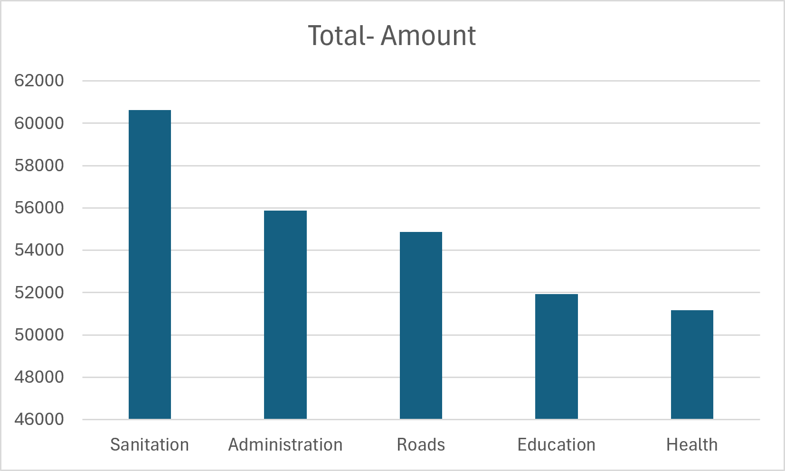

# Bekwai Municipal - Internal Audit Data Analytics
Accounting with Computing Level 200 | Internal Audit Project
## 📊 Project Overview
Analyzed expenditure data for Bekwai Municipal Assembly to identify spending patterns, overspending risks, and budget prioritization using Excel, SQL, Python and Power BI.
## 📸 Dashboard

## 🔍 Key Findings
- **Sanitation - GHS 60,583 (22%)**: Highest expenditure - audit flag for contract review
- **Administration - GHS 55,800**: Second highest, exceeds Education & Health - potential overhead bloat
- **Roads - GHS 54,800 | Education - GHS 51,900 | Health - GHS 51,100**
- Total Analyzed: GHS 274,183 across 5 departments
## 🛠️ Tools Used
- Python (Pandas, Matplotlib) - Data cleaning & analysis
- SQL - Queries for department totals
- Excel - Data validation & pivot tables
- Power BI - Visualization
## 💡 Audit Recommendation
Review sanitation waste contracts and administrative expenses. Reallocate savings to Education and Health service delivery.
## 📂 Files
- `analysis.py` - Python code for analysis
- `queries.sql` - SQL queries
- `chart.png` - Visualization
**Author:** George Opoku-Mensah | HND Accounting with Computing